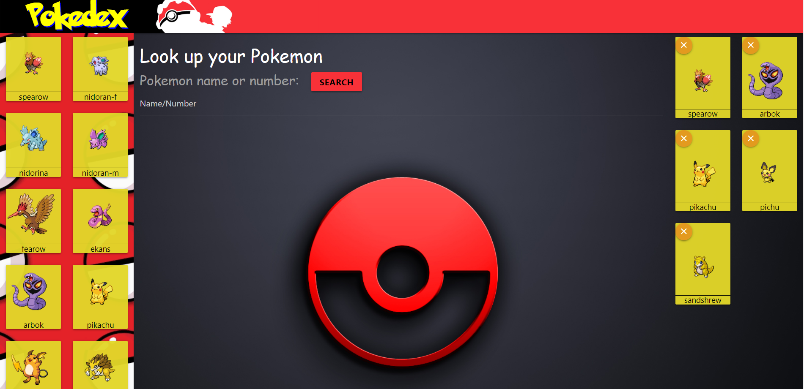

# Pokedex

### Project Description 
This is a course project for Georgia Tech Full Stack Web Development Bootcamp.
This app allows user to select a pokemon character card, view the availalble stats and save the card.
Project data is persisted using [Firebase](https://firebase.google.com) database.

### How to build a deck?
(1) [Click here](https://pshegde123.github.io/pokedex.github.io/) to view the project.

(2) Left panel on the page displays few pokemon cards pre-loaded using `Poke API`. Click on any card, respective GIF and stats are displayed on the page.

(3) To search additional characters use search bar.

(4) If you wish to add that card to your deck click 'Add to Favorite' button.

(5) Cards in the deck are displayed in the right panel.

##### Technologies Used:
* `HTML`,
* `CSS`,
* `JavaScript`,
* `JQuery`,
* `Firebase database`
  
### APIs Used 
* [Poke API](pokeapi.co) - This API provides all the Pokemon data in RESTful format. 
* [Plotly](plot.ly) - Scientific graphing and plotting libraries for making interactive, web-ready, publication-quality graphs.
* [Giphy API](giphy.com) - This API provides largest collection of online GIF's. 

### Authors
Click [here](https://github.com/pshegde123/pokedex.github.io/graphs/contributors) to check contribution history.
